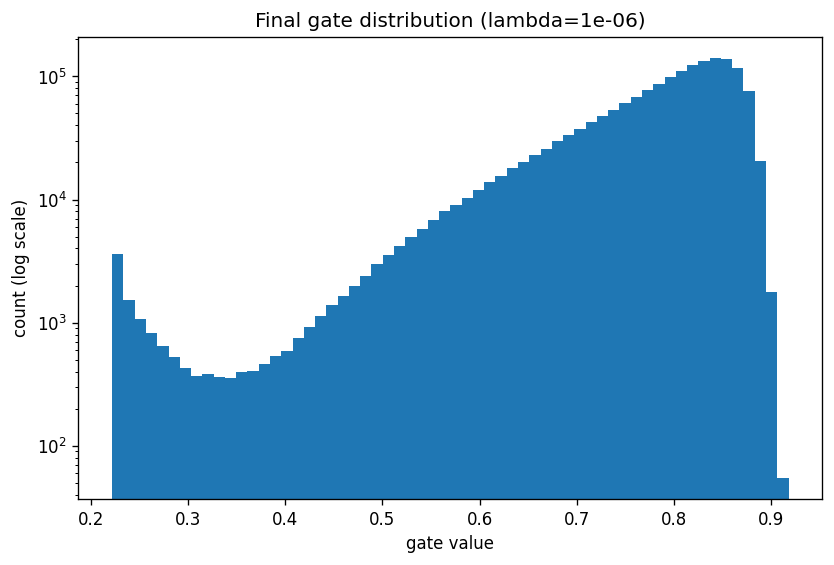

# Self-Pruning Neural Network — Report

## Why an L1 penalty on sigmoid gates encourages sparsity

Every weight is multiplied by `g = sigmoid(s)` where `s` is a learnable score, so each gate sits in `(0, 1)` and is strictly positive. That means the L1 norm of all gates is just `sum(g)`. Adding `lambda * sum(g)` to the loss applies a constant downward pressure on every gate, while the classification loss only pushes back on gates whose weights actually reduce the cross-entropy. Gates attached to useful connections resist because cutting them hurts accuracy more than the L1 term rewards; gates attached to useless connections slide toward zero as `s` drifts to large negative values and `sigmoid(s)` → 0. The outcome is a bimodal distribution — a dense spike near 0 (pruned) and a cluster near 1 (kept) — which is exactly what a good pruning method should produce.

## Results

| Lambda | Test Accuracy (%) | Sparsity Level (%) |
|--------|-------------------|---------------------|
| 1e-06 | 55.14 | 0.00 |
| 1e-05 | 56.13 | 0.00 |
| 0.0001 | 56.57 | 0.00 |

As lambda grows the network is forced to prune more aggressively: sparsity rises while test accuracy falls, giving the expected accuracy–sparsity trade-off.

## Final gate distribution (best run, lambda = 1e-06)

